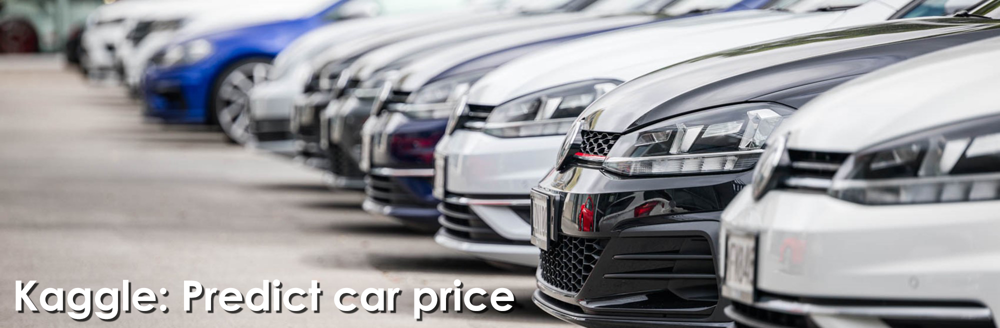

# <center> Kaggle: Прогнозирование стоимости подержанного автомобиля </center>

## Оглавление
1. [Описание проекта](#Описание-проекта)
2. [Описание данных](#Описание-данных)
3. [Зависимости](#Зависимости)
4. [Установка проекта](#Установка-проекта)
5. [Использование проекта](#Использование-проекта)
6. [Выводы](Использование-проекта)

## Описание проекта

**Данный проект** выполнен в рамках учебного курса как тренировочное соревнование на *Kaggle*.

**О структуре проекта:**
* [images](./images) - папка с изображениями, необходимыми для проекта.
* [data](./data) - папка с данными.
* [SF_competition_car_price.ipynb](./SF_competition_car_price.ipynb) - jupyter-ноутбук, содержащий основной код проекта: чтение и обработка данных, преобразование данных и моделирование.


## Описание данных
Добро пожаловать на хакатон по машинному обучению!

Представьте, что вы работаете стажером в компании, которая продает подержанные автомобили, и в какой-то момент к вам приходит руководитель с предложением построить модель для предсказания адекватной стоимости машины по ее характеристикам из объявления.

“Отлично,” – думаете вы, – “наконец-то смогу заняться настоящей работой!”

**Примечание:** Задача, которую мы будем решать, была представлена в качестве [соревнования](https://www.kaggle.com/competitions/sf-dst-predict-car-price/).

## Используемые зависимости
* Python (3.9):
    * [pandas (1.3.4)](https://pandas.pydata.org)
    * [seaborn (0.12.2)](https://plotly.com/python/)
    * [matplotlib (3.6.3)](https://matplotlib.org/)
    * [scikit-learn (1.2.2)](https://scikit-learn.org/stable/index.html)
    * [catboost 1.2](https://catboost.ai/)
    * [category-encoders 2.6.1](https://contrib.scikit-learn.org/category_encoders/)

## Установка проекта
```
git clone https://github.com/MaximZhambalov/SF_Car_Price
```

## Использование
Вся информация о работе представлена в jupyter-ноутбуке SF_competition_car_price.ipynb.

## Выводы
В этом проекте:
- проведён разведовательный анализ данных, обработан и подготовлен датасет для модели;
- была построена модель, предсказывающая стоимость подержанного автомобиля (продажа и аренда). Финальное значение метрики ***MAE*** = $1525$. Метрика для *Kaggle* = $1591$.